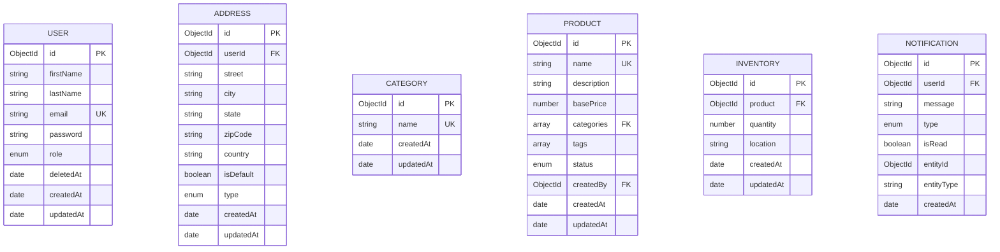

# Mainstack Product Store Manager
## Overview

Product Store Manager is an event-driven product management system designed for handling product lifecycle processes efficiently. The application follows an event-based architecture similar to microservices, where different domains communicate through an event bus.


## Key Features & Technical Accomplishments

->  Event-Driven Architecture:

- When a user signs up in the User Management Domain, an event is triggered to notify the user via the Notification System.

- When product stock is low in the Product Management Domain, an event is fired to alert the warehouse or inventory manager.

->  Domain Separation: The application is structured around different domains such as User Management, Product Management, and Notification Services.

-> Scalable & Modular Design: Loosely coupled services with dependency injection for maintainability.

-> MongoDB as Database: NoSQL document storage for handling flexible data structures.

->  RESTful API with Express.js: Secure and well-structured API endpoints.

->  Dockerized Deployment: Containerized application for easy deployment and scaling.

-> Comprehensive Testing: 80% Unit and integration test suites coverage that ensure application stability.
-> Logging

## Database Design
### Entity Relationship Diagram


## API Design
### Product Management Domain

The following table outlines the API design for the product management domain:

| **HTTP Method** | **Endpoint**                    | **Description**                                     | **Request Body**        | **Response**            |
|-----------------|---------------------------------|-----------------------------------------------------|-------------------------|-------------------------|
| `POST`          | `/products/`                    | Create a new product                                | `CreateProductDTO`      | `Product`               |
| `GET`           | `/products/:id`                 | Fetch a product by its ID                           | N/A                     | `Product`               |
| `PATCH`         | `/products/:id`                 | Update a product's status                           | `UpdateProductDTO`      | `Product`               |
| `DELETE`        | `/products/:id`                 | Delete a product                                    | N/A                     | `Product`               |
| `GET`           | `/products/`                    | Fetch all products with query parameters for filtering | `QueryParams`           | `PaginationResult`      |

---

### Inventory Management (Subdomain of Product Service)

The following table outlines the API design for inventory management, a subdomain of the product service:

| **HTTP Method** | **Endpoint**                              | **Description**                                     | **Request Body**        | **Response**            |
|-----------------|-------------------------------------------|-----------------------------------------------------|-------------------------|-------------------------|
| `POST`          | `/products/:productId/inventory`          | Create inventory for a product                      | `CreateInventoryDTO`    | `Inventory`             |
| `GET`           | `/products/:productId/inventory`          | Fetch inventory details for a specific product      | N/A                     | `Inventory`             |
| `PUT`           | `/products/:productId/inventory`          | Update inventory details for a specific product     | `UpdateInventoryDTO`    | `Inventory`             |
| `PATCH`         | `/products/:productId/inventory`          | Update inventory quantity for a specific product    | `UpdateQuantityDTO`     | `Inventory`             |
| `DELETE`        | `/products/:productId/inventory`          | Delete inventory record for a specific product      | N/A                     | `Inventory`             |
| `GET`           | `/inventories`                            | Fetch all inventories for products with optional filters | `QueryParams`           | `PaginationResult`      |

---

### User Management Domain

The following table outlines the API design for the user management domain:

| **HTTP Method** | **Endpoint**           | **Description**                                    | **Request Body**        | **Response**            |
|-----------------|------------------------|----------------------------------------------------|-------------------------|-------------------------|
| `POST`          | `/auth/signup`              | User registration/signup                          | `SignUpDTO`             | `User`                  |
| `POST`          | `/auth/login`               | User login                                         | `LoginDTO`              | `Tokens`          |
| `GET`           | `/auth/refresh`             | Refresh authentication token                       | N/A                     | `Tokens`          |
| `DELETE`        | `/auth/logout`              | User logout (invalidate token)                     | N/A                     | `N/A`       |
| `PATCH`         | `/users/:id`                 | Update user profile to make user an admin          | `N/A`          | `User`                  |
| `GET`           | `/users/me`                  | Get the current user's profile                     | N/A                     | `User`                  |
| `GET`           | `/users/:id`                 | Fetch a specific user by ID                        | N/A                     | `User`                  |
| `PUT`           | `/users/:id`                 | Update user profile                                | `UpdateProfileDTO`      | `User`                  |

---

### Notification System

The following table outlines the API design for the notification system:

| **HTTP Method** | **Endpoint**                     | **Description**                               | **Request Body**        | **Response**            |
|-----------------|----------------------------------|-----------------------------------------------|-------------------------|-------------------------|
| `GET`           | `/notifications/`               | Fetch all notifications for a user           | N/A                     | `Notifications`      |
| `PATCH`         | `/notifications/:notificationId`| Mark a notification as read                  | N/A                     | `Notification`          |

---

### Summary

- **User Management**: Provides user authentication, profile management, and admin role assignment.
- **Product Management**: Handles the creation, retrieval, updating, and deletion of products. Manages inventory records for products, allowing updates to stock quantities and creation of inventory entries.
- **Notification System**: Notifies users about important events

## Tech Stack
- **Backend:** Node.js, Express.js, EventEmmitter2, Inversifyjs(for singleton DI)
- **Database:** MongoDB. Query fields are indexed for query efficiency
- **Authentication:** JSON Web Tokens (JWT), Argon2 for password hashing
- **Validation:** Class-validator for input validation and sanitation
- **Security:** Helmet for HTTP header security, CORS for cross-origin resource sharing
- **Test:** Jest and supertest
- **Containerization:** Docker


## Design Pattern
- Inversion of control(IoC)
- Repositories layer pattern
- SOLID and DRY principles
- Test Driven Development

## Getting Started
1. **Clone the repository:**
git clone 

2. **Install dependencies:**
`npm install or yarn install`

3. **Set up environment variables:**
- Create a `.env` file in the root directory.
- Define the following variables in the `.env` file:
  ```
  NODE_ENV=development
  PORT=2024
  DATABASE_URI=your_database_connection_string
  JWT_SECRET=your_jwt_secret_key
  ```
4. **Run test:**
`npm run test or yarn test`
5. **Start the development server:**
`npm run start:dev or yarn start:dev`
6. **Start the production server:**
`npm run build or yarn buid`
`npm run start:prod or yarn start:prod`
7. **Start with docker compose:**
`docker-compose up -d --build`


6. **Access the application:**
- Open a web browser and navigate to `http://localhost:5500` to access the application.
- live link https://mainstack-vii7.onrender.com/

## API Documentation & Reference
- https://documenter.getpostman.com/view/27918376/2sAXqqdi8z

## License
This project is licensed under the [MIT License](LICENSE).

## Contributions
Contributions are welcome! If you'd like to contribute to this project, please follow these steps:
1. Fork the repository
2. Create a new branch (`git checkout -b feature`)
3. Make your changes
4. Commit your changes (`git commit -am 'Add new feature'`)
5. Push to the branch (`git push origin feature`)
6. Create a new Pull Request
